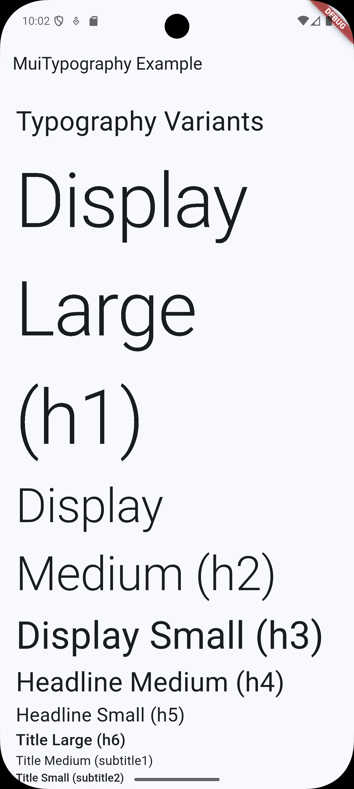

#  📦 mui_typography
[](https://pub.dev/packages/mui_typography) &nbsp;
[](https://github.com/tz-thantzin/mui_typography/blob/main/LICENSE) &nbsp;
[](https://buymeacoffee.com/devthantziq)

A **beautiful, fluent, MUI-inspired typography package** for Flutter — with the **cleanest syntax** you've ever seen.

---


---

## ✨ Features

-   Full set of MUI-like variants (h1 to h6, subtitle1, body1,
    overline, etc.)
-   gutterBottom support (adds bottom margin like MUI)
-   noWrap (ellipsis overflow)
-   paragraph mode (default paragraph spacing)
-   Uses Flutter's **TextTheme** when available

---
## 🛠️ Installation

Add to pubspec.yaml:

```
dependencies:
  mui_typography: ^0.0.1
```
---

## 🚀 Usage

```  dart
import 'package:mui_typography/mui_typography.dart';

//Manual constructor usage
const MuiTypography(
  "Using MuiTypography directly",
  variant: Variant.h5,
  gutterBottom: true,
), 

MuiTypography.h1(
  "Big Title",
  color: Colors.red,
  gutterBottom: true,
),

// Classic variants
"Display Large".h1
"Headline Medium".h4.withGutterBottom
"Subtitle".subtitle1
"Body Text".body2.withParagraph

// Fluent modifiers
"Red Alert".body1.withColor(Colors.red).withNoWrap
"Centered Title".h5.withAlign(TextAlign.center)

// The magic call() syntax
"Instant Button Text"(
  variant: Variant.button,
  color: Colors.white,
)

// Chaining heaven
"Beautifully Styled Card Title"
    .h6
    .withColor(Colors.indigo)
    .withGutterBottom
    .withParagraph
```

---

## 🧠 API Reference
### Fluent Extensions **(Recommended)**

| Method            | Description                        | Example                      |
|-------------------|------------------------------------|------------------------------|
| .withColor(color) | Set text color                     | .withColor(Colors.blue)      |
| .withAlign(align) | Text alignment                     | .withAlign(TextAlign.center) |
| .withNoWrap       | Ellipsis on overflow (single line) | .withNoWrap                  |
| .withGutterBottom | 8px bottom margin                  | .withGutterBottom            |
| .withParagraph    | 16px bottom margin (like <p>)      | .withParagraph               | 

### **MuiTypography** Properties

| Property          | Type              | Default        | Description                                              |
|-------------------|-------------------|----------------|----------------------------------------------------------|
| text              | String            | — (required)   | The text content to display.                             |
| variant           | Variant           | Variant.body1  | Controls the typography style (similar to MUI variants). |
| align             | TextAlign?        | null           | Aligns text (left, right, center, justify).              |
| color             | Color?            | null           | Overrides text color.                                    |
| gutterBottom      | bool              | false          | Adds small bottom margin, similar to MUI's gutterBottom. |
| noWrap            | bool              | false          | Prevents text wrapping and shows ellipsis on overflow.   |
| paragraph         | bool?             | false          | Adds default paragraph spacing (bigger bottom margin).   |

### **Variant** Types

| Variant    | Font Size    | Weight    | Notes               |
|------------|--------------|-----------|---------------------|
| h1         | 96           | w300      | Largest heading     |
| h2         | 60           | w300      | Large heading       |
| h3         | 48           | w400      | Section heading     |
| h4         | 34           | w400      | Smaller heading     |
| h5         | 24           | w400      | Subsection heading  |
| h6         | 20           | w500      | Bold small heading  |
| subtitle1  | 16           | w400      | Subtitle / label    |
| subtitle2  | 14           | w500      | Strong subtitle     |
| body1      | 16           | w400      | Primary body text   |  
| body2      | 14           | w400      | Secondary body      |     
| button     | 14           | w500      | Button-like text    |   
| caption    | 12           | w400      | Small helper text   |  
| overline   | 10           | w400      | All-caps label text | 

---

## ❤️ Author
Created by **Thant Zin**

* GitHub Home: [https://github.com/tz-thantzin](https://github.com/tz-thantzin)
* Repository: [https://github.com/tz-thantzin/mui_typography](https://github.com/tz-thantzin/mui_typography)

Copyright (©️) 2025 __Thant Zin__